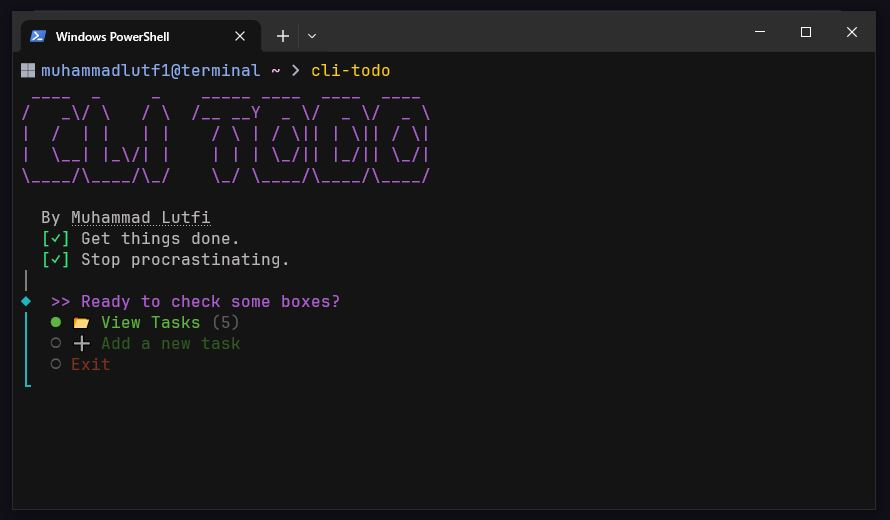

# 📃 CLI TODO App

An interactive CLI todo manager built with Node.js, TypeScript, and @clack/prompts.

and a solution for [Task Tracker](https://roadmap.sh/projects/task-tracker) challenge on [roadmap.sh](https://roadmap.sh)



## Prerequisites

- Node.js: `v22.6.0` or higher (Required for native TypeScript support).

## Setup

```bash
git clone https://github.com/muhammadlutf1/cli-todo.git
cd cli-todo
```

```bash
npm install
```

```
npm start
```

### Global Access

To use the app as a command from anywhere:

```bash
npm link
```

```bash
cli-todo # run it
```

## Todo list

- [ ] Focus Timer

**Contributions are welcome :)**
